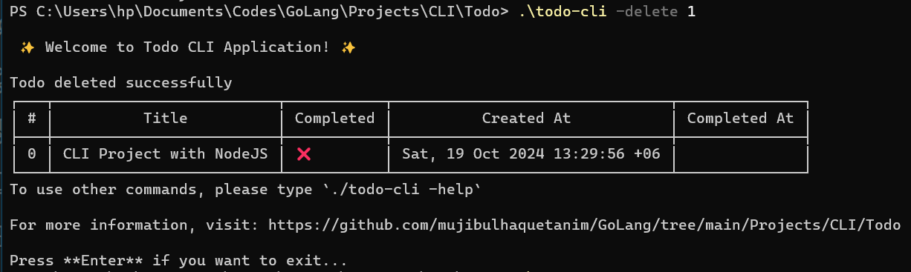

# Todo CLI Application

This is a Command-Line Interface (CLI) application for managing your to-dos, built with Golang. It allows you to add, remove, edit, list, and complete tasks directly from your terminal.

## Features

- Add new to-dos
- List all to-dos in a tabular format
- Mark to-dos as completed
- Delete to-dos
- Edit to-dos
- Track creation and completion times

## Packages Used

- `flag`: To handle command-line arguments.
- `aquasecurity/table`: To display to-dos in a tabular format.
- `os`: For file operations.
- `encoding/json`: For JSON utilities, like converting to-dos to bytes for storage.
- `time`: To manage creation and completion times of to-dos.
- `strconv`: To convert index values to strings for display in the table.

## Run the .exe/binary file following the given instructions

```bash
    ./todo-cli -h   #for help
    ./todo-cli -list    #to list all todos
    ./todo-cli -add 'todo item'     #to add a new todo
    ./todo-cli -toggle 'indexNumber'    #to toggle a todo
    ./todo-cli -edit 'indexNumber: new todo item'   #to edit a todo
    ./todo-cli -delete 'indexNumber'  #to delete a todo
```

**Note:** Get the index number from the todo table. If the executable file doesn't create any todo.json file, it means you have not given folder access to it, to enable it, goto the `Controlled folder access`. For more help, Please use Youtube/google to enable it.

<details>
    <summary>Image Examples:</summary>

### Add Todo


### Edit Todo


### Toggle Todo


### Delete Todo



### Print Todo


</details>

**Note:** if you directly run the binary without specifying any argument like -add,-list etc. it will show Invalid Command as it can't match any actions.
